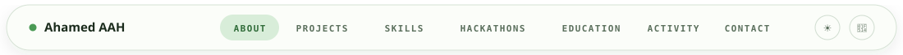
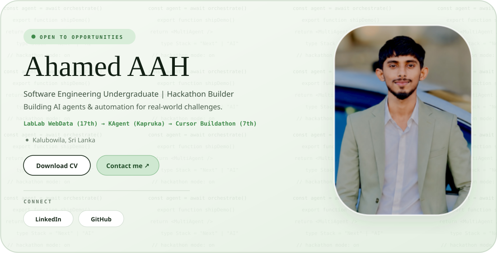
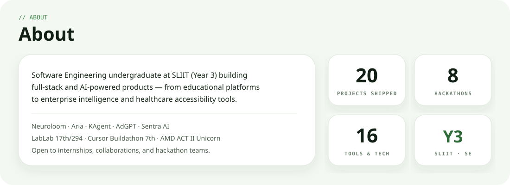
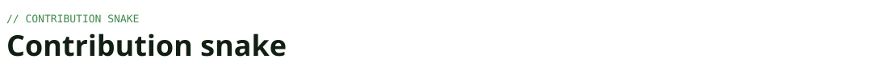
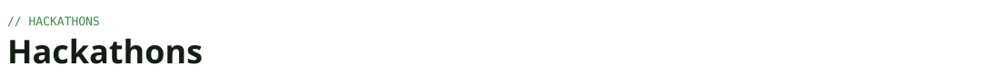
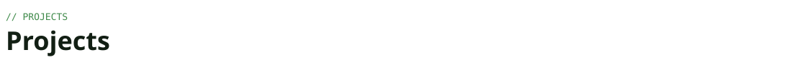
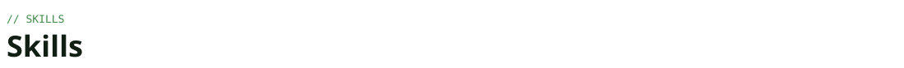
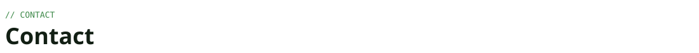

<!-- Portfolio-style GitHub profile — visual UI mirrored from https://ahamed-4e0q.onrender.com -->

<div align="center">

  

  <br/><br/>

  

  <br/>

  <a href="https://ahamed-4e0q.onrender.com/cv/Ahamed_AAH.pdf">
    
  </a>
  <a href="mailto:hubaibahamedaaha@gmail.com">
    
  </a>
  <a href="https://www.linkedin.com/in/hubaib-ahamed-a67732351/">
    
  </a>
  <a href="https://github.com/AhamedAAHA">
    
  </a>
  <a href="https://ahamed-4e0q.onrender.com/">
    
  </a>
  
  

  <br/><br/>

  

  <br/>

  

  <br/><br/>

  

  <br/>

  

</div>

---

<div align="center">
  
</div>

<div align="center">

  

  <br/><br/>

  

  <br/><br/>

  

  <br/>

  

</div>

---

<div align="center">
  
</div>

<div align="center">
  <picture>
    <source media="(prefers-color-scheme: dark)" srcset="https://raw.githubusercontent.com/AhamedAAHA/AhamedAAHA/output/github-contribution-grid-snake-dark.svg" />
    <source media="(prefers-color-scheme: light)" srcset="https://raw.githubusercontent.com/AhamedAAHA/AhamedAAHA/output/github-contribution-grid-snake.svg" />
    
  </picture>

  <br/>

  
</div>

---

### 3D contribution universe

Animated isometric contribution calendar — regenerates daily via GitHub Actions.

<div align="center">
  <picture>
    <source media="(prefers-color-scheme: dark)" srcset="https://raw.githubusercontent.com/AhamedAAHA/AhamedAAHA/main/profile-3d-contrib/profile-night-green.svg" />
    
  </picture>
</div>

<details>
<summary><b>More 3D themes</b></summary>

<br/>

<div align="center">

  

  <br/><br/>

  

</div>

</details>

---

<div align="center">
  

  
</div>

```text
2026 ──┬── LabLab WebData .............. Sentra AI .............. 17th / 294
       ├── Cursor Buildathon ........... Smart Study Companion .. 7th place
       ├── Cursor Live Sri Lanka ....... AdGPT .................. 2-hour ship
       ├── Kapruka Agent Challenge ..... KAgent ................. multi-agent
       ├── Hack the Zero Stack ......... Aria ................... Vercel + AWS
       └── AMD ACT II (Unicorn) ........ Neuroloom .............. Gemma on AMD
```

---

<div align="center">
  
</div>

### Pinned projects

<div align="center">

  <a href="https://github.com/AhamedAAHA/neuroloom">
    
  </a>
  <a href="https://github.com/AhamedAAHA/Aria">
    
  </a>
  <a href="https://github.com/AhamedAAHA/kagent">
    
  </a>
  <a href="https://github.com/AhamedAAHA/Sentra-AI">
    
  </a>

  <br/><br/>

  <a href="https://web-three-sable-48.vercel.app/"></a>
  <a href="https://aria-zeta-virid.vercel.app"></a>
  <a href="https://kagent-nine.vercel.app"></a>
  <a href="https://sentra-one-kappa.vercel.app/"></a>
  <a href="https://adgpt-nine.vercel.app"></a>
  <a href="https://cyanide-x.vercel.app/"></a>

</div>

| Project | What it is | Stack | Links |
|---|---|---|---|
| **Neuroloom** | Family-care command center — 9 Gemma agents on AMD GPUs | Next.js · FastAPI · LangGraph · Postgres · ROCm · vLLM | [Live](https://web-three-sable-48.vercel.app/) · [Repo](https://github.com/AhamedAAHA/neuroloom) |
| **Aria** | AI hiring OS — voice/CV parse, explainable matching, Kanban | Next.js · Aurora · Cognito · GPT-4o · Speechmatics | [Live](https://aria-zeta-virid.vercel.app) · [Repo](https://github.com/AhamedAAHA/Aria) |
| **KAgent** | 7-agent shopping swarm for Kapruka life situations | Next.js · Claude · Framer Motion · Zustand | [Live](https://kagent-nine.vercel.app) · [Repo](https://github.com/AhamedAAHA/kagent) |
| **AdGPT** | Static ads → short-form video in a 2-hour live build | Next.js · OpenAI · Remotion · Supabase | [Live](https://adgpt-nine.vercel.app) · [Repo](https://github.com/AhamedAAHA/AdGPT) |
| **CyanideX** | Cyber threat intelligence OS with 3D threat globe | Next.js · Three.js · Java · Bright Data | [Live](https://cyanide-x.vercel.app/) · [Repo](https://github.com/AhamedAAHA/CyanideX) |
| **Sentra AI** | Live GTM intelligence — **17th of 294** at LabLab WebData | Next.js · Supabase · Bright Data · Speechmatics | [Live](https://sentra-one-kappa.vercel.app/) · [Repo](https://github.com/AhamedAAHA/Sentra-AI) |

<details>
<summary><b>More projects</b></summary>

| Project | Focus | Repo |
|---|---|---|
| **Suzie** | Global / geopolitical intelligence OS | [Suzie](https://github.com/AhamedAAHA/Suzie) |
| **GestureMed** | Healthcare accessibility via gesture interfaces | [GestureMed](https://github.com/AhamedAAHA/GestureMed) |
| **Smart Study Companion** | Cursor Buildathon — PDF → flashcards + Tamil voice | [SmartStudyCompanionAAHA](https://github.com/AhamedAAHA/SmartStudyCompanionAAHA) |
| **Lumora** | Product experiment | [Lumora](https://github.com/AhamedAAHA/Lumora) |
| **DeeBug** | Debugging / tooling experiment | [DeeBug](https://github.com/AhamedAAHA/DeeBug) |
| **Portfolio** | Personal site (React · TS · Tailwind · Vite) | [Portfolio](https://github.com/AhamedAAHA/Portfolio) · [Live](https://ahamed-4e0q.onrender.com) |

</details>

---

<div align="center">
  
</div>

<p align="center">
  
</p>

### Languages


### Frontend & 3D


### Backend & data


### AI & intelligence


### Cloud & tooling


---

## How I work

| Mode | What you get |
|---|---|
| **Hackathon mode** | Scoped idea → working demo in hours, not weeks |
| **Agent mode** | Multi-agent graphs, tool use, eval loops, voice I/O |
| **Product mode** | Next.js UI + FastAPI/Node APIs + real data stores |
| **Collab mode** | Clear owners, fast PRs, demo-first storytelling |

---

<div align="center">
  
</div>

```ts
const ahamed = {
  role: "Software Engineering Undergrad @ SLIIT (Y3)",
  focus: ["AI Agents", "Full-Stack", "Multi-Agent Systems", "Voice AI"],
  recent: ["Neuroloom", "Aria", "KAgent", "AdGPT", "CyanideX", "Sentra AI"],
  lookingFor: ["Internships", "Collaborations", "Hackathon teams"],
  contact: "hubaibahamedaaha@gmail.com",
  portfolio: "https://ahamed-4e0q.onrender.com",
};
```

<p align="center">
  <a href="https://github.com/AhamedAAHA"></a>
  <a href="https://www.linkedin.com/in/hubaib-ahamed-a67732351/"></a>
  <a href="mailto:hubaibahamedaaha@gmail.com"></a>
  <a href="https://ahamed-4e0q.onrender.com/"></a>
</p>

<p align="center">
  
</p>

<p align="center">
  <sub>Built for builders · portfolio UI + snake · 3D contrib · live demos · widgets via Actions · <a href="https://ahamed-4e0q.onrender.com/">ahamed-4e0q.onrender.com</a></sub>
</p>
